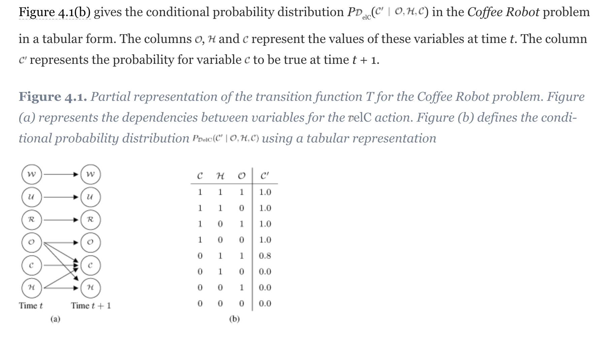
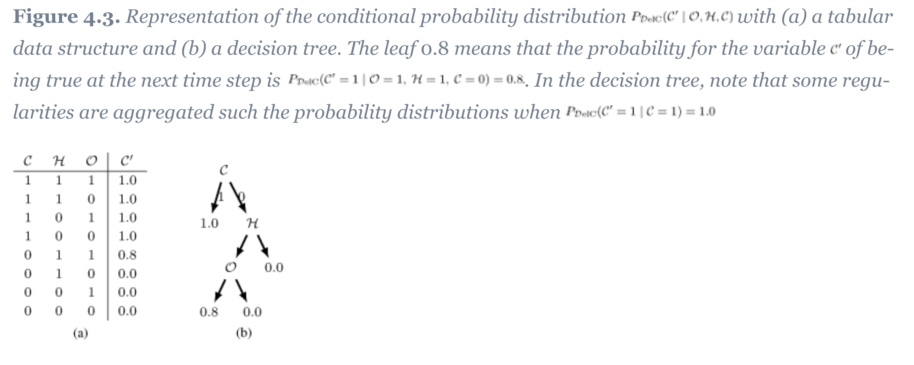

# Representation of **transition function**

Transition functions can be represented with **Dynamic Bayesian Network(DBN)**, **Conditional Probability Table(CPT)** and **Decision Tree(DT)**:
+ DBN: to represent the dependencies of the variables between time *t* and *t*+1 `under a specific action`
+ CPT: to represent the conditional probability distribution of one state variable at time *t*+1 given its parent variables at time *t* `under a specific action`
+ DT: to represent the conditional probability distribution of one state variable at time *t*+1 given related variables at time *t* `under a specific action`. The leaf nodes means the probability distribution of one state variable at time *t*+1.

Figure below shows the transition functions represented with DBN and CPT with a specific action.

Figure below shows the transition functions represented with CPT and DT with a specific action.

For detailed, see https://learning-oreilly-com.tudelft.idm.oclc.org/library/view/markov-decision-processes/9781118620106/xhtml/Chapter04.html
